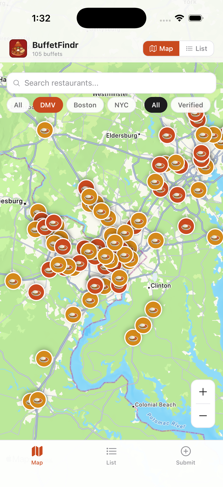
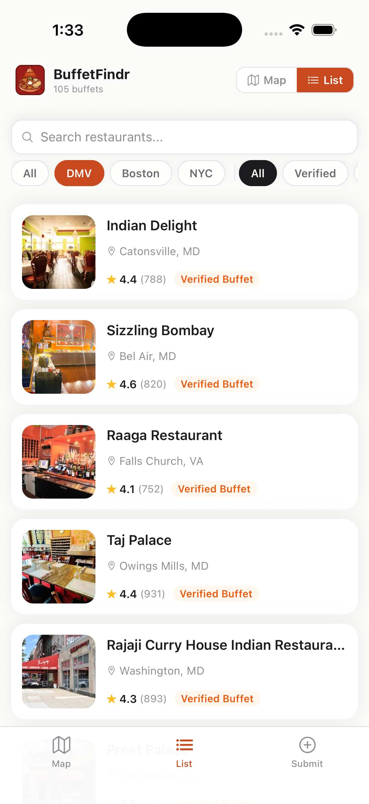
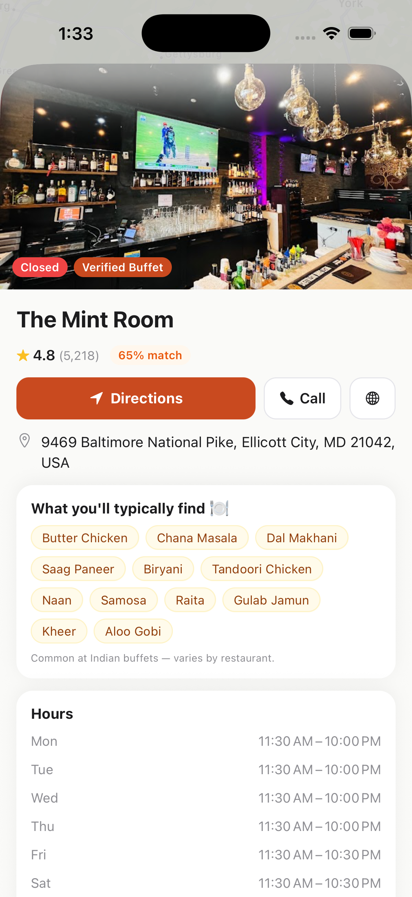
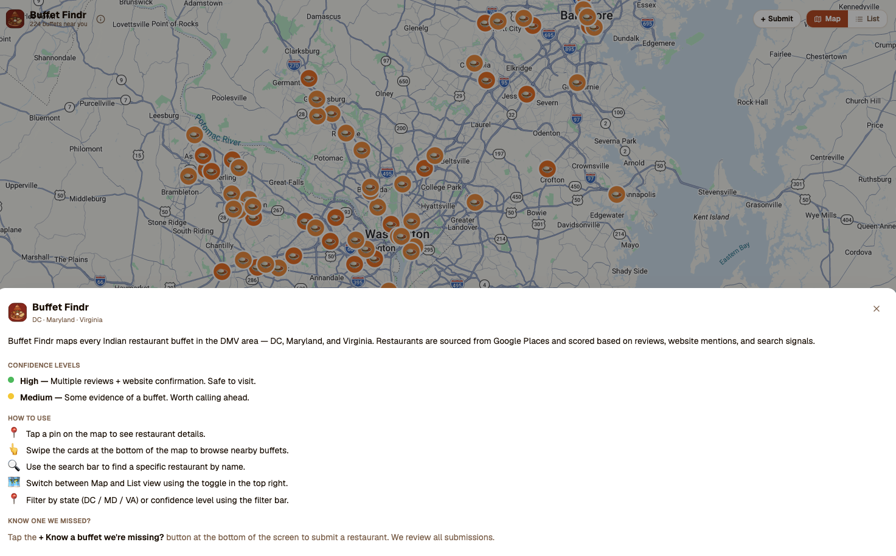
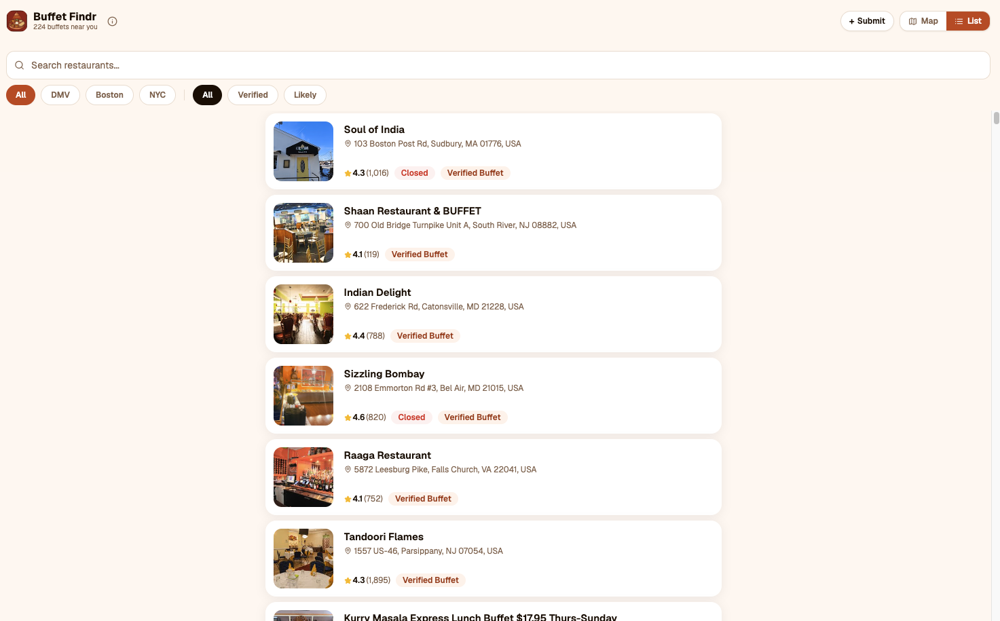
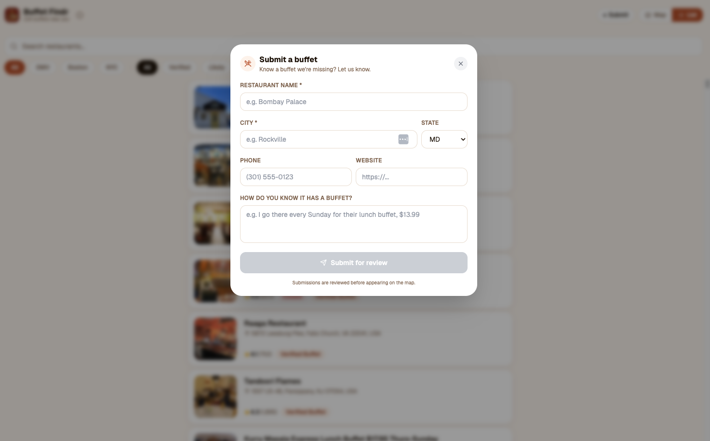
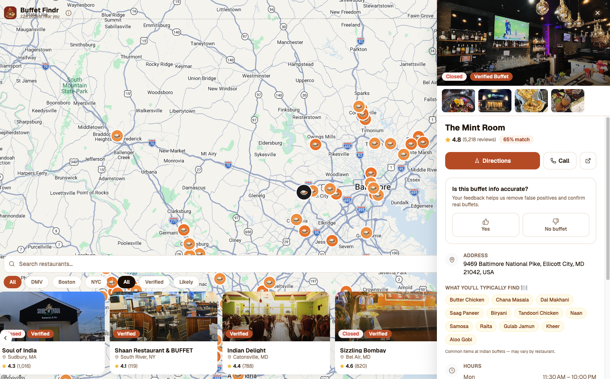

# BuffetFindr

**The only app that finds every Indian buffet near you.**

BuffetFindr is a free web app and iOS app that maps Indian (and South Asian) buffet restaurants across the DMV, Boston, and NYC. No more Googling — every verified buffet in one place, with hours, ratings, photos, directions, and community confirmation.

🌐 **Web**: [buffetfindr.com](https://www.buffetfindr.com)  
📱 **iOS**: App Store (pending review)  
🔒 **Privacy**: [buffetfindr.com/privacy](https://www.buffetfindr.com/privacy)

---

## Screenshots

### iOS App

<table>
  <tr>
    <td align="center"><b>Map View</b></td>
    <td align="center"><b>List View</b></td>
    <td align="center"><b>Restaurant Detail</b></td>
  </tr>
  <tr>
    <td></td>
    <td></td>
    <td></td>
  </tr>
</table>

### Web App

<table>
  <tr>
    <td align="center"><b>Map View</b></td>
    <td align="center"><b>Map + Detail Sidebar</b></td>
  </tr>
  <tr>
    <td></td>
    <td></td>
  </tr>
  <tr>
    <td align="center"><b>List View</b></td>
    <td align="center"><b>Submit a Buffet</b></td>
  </tr>
  <tr>
    <td></td>
    <td></td>
  </tr>
</table>

---

## What BuffetFindr Does

Indian buffets are notoriously hard to find online. They don't show up reliably in search, Yelp results are inconsistent, and Google Maps doesn't let you filter by "has buffet." BuffetFindr solves this by:

1. **Scraping Google Places** for every Indian restaurant in a metro area
2. **Scoring each one** for buffet likelihood using reviews, website content, and search signals
3. **Surfacing them on a map and list** — filterable by region, confidence, and search
4. **Letting the community verify** — thumbs up/down on each listing to confirm accuracy
5. **Accepting user submissions** — know a buffet we missed? Submit it for review

### Who It's For

- **Desi diaspora** who grew up on buffets and want to find them easily in a new city
- **Indian food lovers** who want an affordable, high-quality lunch
- **Families** looking for a place where everyone can eat for a flat price
- **Anyone new to a city** who wants to know where the nearest Indian buffet is

---

## Features

### 🗺️ Interactive Map
- Full-screen Google Maps with custom 🍛 pins for every buffet
- Orange pins = HIGH confidence (verified buffet) · Gold pins = MEDIUM confidence
- Click any pin to open the restaurant detail panel
- Region filters (DMV / Boston / NYC) pan and zoom the map automatically

### 📋 List View
- Scrollable card list with restaurant photo, name, city, rating, and buffet badge
- Same filtering as the map — switch seamlessly between views
- Sorted by buffet confidence score

### 🍽️ Restaurant Detail
- Hero photo + photo gallery strip
- Open/Closed status based on current time
- One-tap Directions (Apple Maps / Google Maps), Call, and Website buttons
- **"What you'll typically find"** — common Indian buffet dishes (Butter Chicken, Biryani, Naan, etc.)
- Full hours table with today highlighted
- **"Have you visited?"** tracker — saved locally on your device
- **Community feedback** — thumbs up/down to confirm or dispute buffet status
- Collapsible "Why we think it's a buffet" evidence section

### 🔍 Filters
| Filter | What it does |
|---|---|
| **All / DMV / Boston / NYC** | Show only restaurants in that metro area |
| **All / Verified / Likely** | Filter by buffet confidence score |
| **Search bar** | Filter by restaurant name or address |

### ➕ Submit a Buffet
Know a buffet we don't have? Hit **+ Submit** and fill in the restaurant name, city, and how you know it has a buffet. Submissions are reviewed before going live.

---

## Coverage

| Metro Area | Buffets Found |
|---|---|
| DMV (DC, Maryland, Virginia) | ~133 |
| Boston & suburbs | ~42 |
| NYC (all 5 boroughs + Long Island + NJ) | ~77 |
| **Total** | **~252** |

Restaurants scored 30+ on a buffet confidence rubric (0–100) based on Google Places reviews, website content, and search query matching.

---

## Technical Architecture

### Stack

| Layer | Technology |
|---|---|
| **Web frontend** | Next.js 15 (App Router), Tailwind CSS, Framer Motion |
| **Mobile app** | Expo 54 / React Native 0.81, Expo Router |
| **Maps** | Google Maps JS API (web), react-native-maps (mobile) |
| **Database** | Neon PostgreSQL (serverless, Vercel Marketplace) |
| **ORM** | Drizzle ORM |
| **Deployment** | Vercel (web + API) |
| **CI/CD** | GitHub → Vercel (auto-deploy on push to `main`) |
| **Mobile builds** | Expo EAS Build + EAS Submit |

### Repository Structure

```
buffetfindr/
├── scraper/          Python data pipeline
│   ├── main.py       Google Places API scraper (Places API New)
│   ├── scorer.py     Buffet likelihood scoring engine
│   ├── locations.py  Coordinate grids per metro area
│   ├── reprocess.py  Re-score without hitting the API
│   ├── pipeline.sh   End-to-end scrape → seed → deploy script
│   └── known_buffets_override.json  Manually verified restaurants
│
├── web/              Next.js 15 web app
│   ├── app/          App Router pages & API routes
│   ├── components/   React components
│   ├── db/           Drizzle schema + seed script
│   └── data/         Scraped JSON files (source of truth for seeding)
│
├── mobile/           Expo React Native iOS/Android app
│   ├── app/          Expo Router screens
│   ├── components/   React Native components
│   ├── lib/api.ts    Fetches from live Vercel API
│   └── eas.json      EAS Build + App Store config
│
├── mcp/              Claude Code MCP plugin
│   └── server.js     Exposes scraper tools to Claude
│
└── screenshots/      App screenshots for README
```

### How the Scraper Works

The scraper runs a grid search across ~30 coordinates per metro area using **Google Places API (New)**:

1. **Text Search** — queries `"Indian restaurant"` and `"Indian buffet"` within 12km of each grid point
2. **Place Details** — fetches reviews, hours, photos, website for each result
3. **Website Scraping** — checks the restaurant's own website for buffet keywords (BeautifulSoup)
4. **Scoring** — assigns a 0–100 buffet confidence score:

| Signal | Points |
|---|---|
| "buffet" in restaurant name | +50 |
| 3+ Google reviews mention buffet | +40 |
| 2 reviews mention buffet | +25 |
| 1 review mentions buffet | +15 |
| Restaurant website mentions buffet | +30 |
| Found via "Indian buffet" search query | +20 |
| Google editorial summary mentions buffet | +15 |
| Negative signals ("no longer has buffet") | −20 |

5. **Deduplication** — by `place_id` across overlapping search circles
6. **Output** — `{state}_raw.json` (all restaurants) + `{state}_buffets.json` (score ≥ 30)

### Database Schema

Three tables in Neon PostgreSQL:

```sql
restaurants           -- 252 buffets with location, hours, photos, buffet score
restaurant_feedback   -- anonymous thumbs up/down votes per restaurant
restaurant_submissions -- user-submitted restaurants pending review
```

See [`web/db/SCHEMA.sql`](web/db/SCHEMA.sql) for the full annotated schema.

### API Routes

| Endpoint | Description |
|---|---|
| `GET /api/restaurants` | Returns buffets filtered by region, confidence, search |
| `POST /api/feedback` | Submit a thumbs up/down vote |
| `GET /api/feedback` | Get vote counts for a list of `place_id`s |
| `POST /api/submissions` | Submit a new restaurant for review |
| `GET /api/submissions` | List all pending submissions (admin) |

The restaurants API automatically uses **Neon DB in production** and falls back to **local JSON files in development** (detected via `DATABASE_URL` presence).

---

## Running Locally

### Prerequisites
- Node.js 18+
- Python 3.9+
- Google Places API key (with Places API New + Maps JavaScript API enabled)
- Neon PostgreSQL connection string (or use local JSON files without one)

### Web App

```bash
git clone https://github.com/arpan-ghosh/buffetfindr
cd buffetfindr/web

# Install dependencies
npm install

# Set up environment
cp .env.local.example .env.local
# Edit .env.local with your NEXT_PUBLIC_GOOGLE_MAPS_API_KEY
# (DATABASE_URL optional — app uses local JSON files without it)

# Start dev server
npm run dev
# → http://localhost:3000
```

### Scraper

```bash
cd scraper

# Install Python dependencies
pip install -r requirements.txt

# Set up API key
cp .env.example .env
# Edit .env with your GOOGLE_PLACES_API_KEY

# Scrape a region (takes ~15-20 min)
python main.py --state maryland
# Options: maryland | virginia | dc | massachusetts | new_york | all

# Copy output to web app
cp data/maryland_buffets.json ../web/data/

# Seed the database (requires DATABASE_URL in web/.env.local)
cd ../web && npm run db:seed
```

### Mobile App

```bash
cd mobile
npm install --legacy-peer-deps

# Run on iOS Simulator (requires macOS + Xcode)
npx expo run:ios

# After adding new native packages, rebuild:
npx expo run:ios  # (always full rebuild for native changes)
```

---

## Deployment

### Web (Vercel)

Every push to `main` auto-deploys via GitHub integration. Manual deploy:

```bash
cd web
vercel --prod
```

### iOS (App Store via EAS)

```bash
cd mobile

# Production build + auto-submit to App Store Connect
npx eas-cli@latest build --platform ios --profile production --auto-submit

# Check build status
npx eas-cli@latest build:list --platform ios --limit 5

# Submit a specific build manually
npx eas-cli@latest submit --platform ios --id <build-id>
```

---

## Adding a New City

1. Add coordinate grid to `scraper/locations.py` → `STATE_MAP`
2. Add state key to `scraper/main.py` `--state` choices
3. Run the scraper: `python scraper/main.py --state <new_state>`
4. Copy output: `cp scraper/data/<state>_buffets.json web/data/`
5. Add state to `web/scripts/seed.ts` states array
6. Add region to `web/app/api/restaurants/route.ts` (`REGION_FILES` + `REGION_STATES`)
7. Add region pill to `web/components/FilterBar.tsx` and `mobile/app/index.tsx`
8. Run `cd web && npm run db:seed`
9. Deploy: `cd web && vercel --prod`

---

## Contributing

Found a buffet we're missing? Use the **Submit** button in the app or web.

Found a bug? Open an issue on GitHub.

Want to expand coverage to a new city? The scraper is fully parameterized — PRs welcome.

---

## License

MIT — free to use, modify, and distribute.

---

*Built with Claude Code · Powered by Google Places API · Hosted on Vercel · Database by Neon*
